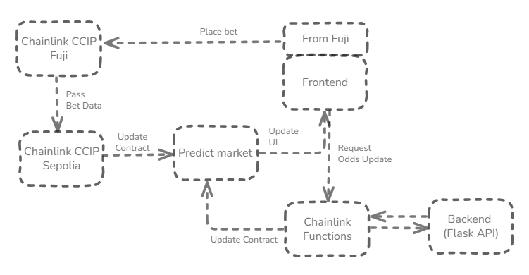

# CryptoBet - A Cross-chain Prediction Market with AI Powered Odds

A cross-chain prediction market platform for sports betting with AI-powered odds and real-time data feeds.

## Features

-  **AI-Powered Odds**: Machine learning models combined with real-time market data
-  **Cross-Chain Betting**: Bet from Avalanche Fuji using CCIP-BnM tokens on Ethereum Sepolia markets
-  **Real-Time Updates**: Live odds updates periodically
-  **Multiple Markets**: Support for various sports prediction markets
-  **Multi-Asset Support**: ETH and cross-chain token betting


## Tech Stack

- **Frontend**: React, Ethers.js, CSS
- **Backend**: Python Flask, Selenium, OpenAI
- **ML**: Scikit-learn, Pandas
- **Blockchain**: Solidity, Ethereum, Avalanche

## Chainlink Integration

This project leverages multiple Chainlink services:

### -  Chainlink Functions
**File**: [`FunctionsConsumer.sol`](./src/FunctionsConsumer.sol)

Fetches real-time ML-powered odds from external APIs using Chainlink's decentralized compute network.

```solidity
function requestOdds(
    string[] memory args,
    uint64 subscriptionId,
    uint32 gasLimit
) external onlyOwner returns (bytes32 requestId)
```

### -  Chainlink CCIP  
**File**: [`CCIPBetBridge.sol`](./src/CCIPBetBridge.sol)

Enables cross-chain betting between Avalanche Fuji and Ethereum Sepolia with token transfers with data.

```solidity
function sendBetWithToken(
    uint64 destinationChainSelector,
    address receiver,
    string calldata eventId,
    bool prediction,
    address token,
    uint256 amount,
    bool payWithLINK
) external payable returns (bytes32 messageId)
```

### -  Contract Utilities
**File**: [`contractUtils.js`](./frontend/src/contractUtils.js)

Frontend integration utilities for Chainlink services including cross-chain betting and Functions interaction.

## Architecture



## Installation

### Prerequisites

```bash
# Node.js dependencies
npm install ethers react lucide-react

# Python dependencies  
pip install flask pandas scikit-learn selenium openai schedule python-dotenv

# Get ngrok token
```

### Environment Setup

Create  `.env`, `new.env` file:

```bash
CHAINLINK_SUBSCRIPTION_ID=your_subscription_id
OPENAI_API_KEY=your_openai_key
....
```

### Smart Contract Deployment

1. Deploy `MarketRegistry.sol`
2. Deploy `FunctionsConsumer.sol` 
3. Deploy `PredictionMarketExtended.sol`
4. Deploy `CCIPBetBridge.sol` on both chains
5. Configure cross-chain mappings in `config.js`

### Running the Application

1. **Start the ML API server**:
```bash
cd backend
python odds_api.py
```

2. **Start the real-time data agent**:
```bash
python agent_real_time_odds.py
```

3. **Start the frontend**:
```bash
npm run dev
```

4. **Start the ngrok tunnel**:
```bash
ngrok config add-authtoken  YOURTOKEN
ngrok http --url=YOURDOMAIN 5001
```

## Usage

### Creating Markets

After setting up, run ```DeployAll_new.s.sol```
```
forge script script/DeployAll_new.s.sol --broadcast  --private-key $wallet_private_key

```

### Placing Bets

**Ethereum Sepolia (ETH)**:
```javascript
await predictionMarket.placeBet(prediction, { value: ethAmount });
```

**Cross-chain from Avalanche Fuji (CCIP-BnM)**:
```javascript
await ccipBridge.sendBetWithToken(
    sepoliaSelector, receiver, eventId, prediction, token, amount, true
);
```

### Updating Odds

Odds are automatically updated via Chainlink Functions:

```javascript
await functionsConsumer.requestOdds(["Team A vs Team B"], subscriptionId, gasLimit);
```

## Network Configuration

### Ethereum Sepolia
- **Prediction Markets**: Main betting contracts
- **Chainlink Functions**: Odds updates
- **Currency**: ETH

### Avalanche Fuji  
- **CCIP Bridge**: Cross-chain betting
- **Currency**: CCIP-BnM tokens

## File Structure

```
├── src/
│   ├── PredictionMarketExtended.sol    # Main prediction market
│   ├── FunctionsConsumer.sol          #  Chainlink Functions
│   ├── CCIPBetBridge.sol             #  Chainlink CCIP  
│   └── MarketRegistry.sol            # Market discovery
├── script/
│   ├── DeployAll_new.s.sol 
│
├── frontend/
│   ├── App.jsx                       # Main application
│   ├── MarketList.jsx               # Market interface
│   ├── contractUtils.js             # 🔗 Chainlink utilities
│   └── CountdownTimer.jsx           # UI components
└── backend/
    ├── odds_api.py                  # ML odds API
    ├── agent_real_time_odds.py      # Data scraping
    └── matchPredictionTraining.py   # ML model training
```

## API Endpoints

### Odds API
```
POST /odds
Content-Type: application/json

{
  "event": "Brazil vs Argentina"
}

Response:
{
  "yes": 65,
  "no": 35
}
```

## Security

- **Allowlisted Chains**: CCIP bridges only accept transactions from approved chains
- **Sender Validation**: Only authorized addresses can trigger cross-chain bets
- **Time-Based Controls**: Markets automatically close and settle based on timestamps
- **Subscription Access**: Chainlink Functions protected by subscription model


## License

MIT License - see LICENSE file for details

---

*Powered by Chainlink's decentralized oracle network*